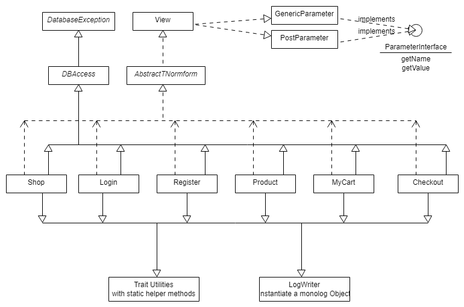

# OnlineShop
*OnlineShop* provides a basic skeleton for database exercises, that use PDO for accessing MariaDB from PHP.

The code is meant only for educational purpose, even though some parts can be used for smaller web projects.
We try to meet web, coding and security standards as far as possible in these basic lessons.

Templates and CSS are complete, because this part is taught in different lessons. So these exercises can focus on
database access with PHP Libraries.

Visit us at https://www.fh-ooe.at/en/hagenberg-campus/studiengaenge/bachelor/media-technology-and-design/

# Basic usage

* ``cd <code>`` which should be accessible for your web server.
* ``sudo git clone https://github.com/Digital-Media/onlineshop.git onlineshop``
* ``cd onlineshop``
* ``composer install``

# Used technologies and requirements

The exercises have been developed with [Vagrant](https://www.vagrantup.com/) and [Virtualbox](https://www.virtualbox.org/). 
A [Vagrantfile](https://github.com/Digital-Media/hgb-phpdev) with the installation of the web environment with MariaDB is hosted on GitHub.
A [second Vagrantfile](https://github.com/Digital-Media/hgb-dbdev) with the installation of the web environment and the 
search engine ElasticSearch and Redis is hosted on GitHub as an alternative environment.
But *OnlineShop* can be installed in a different environment as well. 
[XAMPP](https://www.apachefriends.org/de/download.html) or [MAMP](https://www.mamp.info/de/)

PHP 7.1 is required to run the examples.

* [HTML5](https://www.w3.org/TR/html5/)
* [CSS3](https://www.w3.org/Style/CSS/specs)
* [PHP 7.0](http://php.net/manual/en/migration70.new-features.php)
* [PHP 7.1](http://php.net/manual/en/migration71.new-features.php)
* [MariaDB](https://mariadb.org/)
* [PDO-Datenbankschnittstelle](http://php.net/manual/en/book.pdo.php)
* [Normform](https://github.com/Digital-Media/normform)
* [TWIG Templates](https://twig.symfony.com/)
* [CSS3 Flexbox](https://www.w3.org/TR/css-flexbox-1/)
* [PHP-FIG PSR: PHP Standards Recommendations](https://www.php-fig.org/psr/)
* [Monlog PSR3](https://github.com/Seldaek/monolog)
* [ElasticSearch PHP Client 6.0](https://www.elastic.co/guide/en/elasticsearch/client/php-api/current/index.html) (second Vagrantfile)
* [Redis PHP Client](https://packagist.org/packages/predis/predis) (second Vagrantfile)

The files, that have to be completed for the exercises, are stored in the subdirectory ``src/exercises``.
All other files are for reference.

PHP Errors are logged in
* ``onlineshop/src/onlineshop.log``
* the Apache error log ``tail -f /var/log/apache2/error.log`` or wherever it resides in your installation.

Sample solutions from a solution folder can be copied into the exercise templates with the class src/Solution/Solution.php.
The git repository, that holds the solution is private. If necessary ``TODO``s will guide you, what has to be done for completing the exercises. 
For a better understanding read the PHPDoc comments, that describe the classes, methods, properties and constants and have a look at the provided example src/DBAccess/DBDemo.php. You can use ``onlineshop/src/onlinshop.sql`` to restore the MariaDB database provided for the excercises.

For example the following line is replaced with the content of <solutionfolder>/index/construct.inc.php:  
    
    //%%<path-to-solution>/index/construct

Given parts of the solution are marked as seen below. These parts ensure, that the code works without PHP runtime errors, even before the exercise is completed.
     
     //##%%
     return true;
     //#%#%
     
For example a fake login is implemented in a way, that you can login without given user credentials. 
To complete the exercise you have to implement the database access to validate the given user credentials.
Keep these parts of the code, they may be part of your final solution, if you put them on the right place in your own code.

## Structure of this Repository

Folder | Description
--- | ---
``htdocs`` |Frontend stuff. Files accessed by the web server. They initialize the classes with the actual implementation. CSS
``htdocs/css`` | A set of predefined styles to be used with *NormForm*. Include ``main.css`` to use it.
``templates`` | HTML templates for the TWIG template engine used in ``/src/*.php``.
``templates_c`` | Output folder for compiled TWIG templates.
``src`` | ``define.inc.php`` holds the constants to access the database. Scripts to load Data to MariaDB and ElasticSearch. A class diagramm for onlineshop.
``src/DBAccess`` | Classes implemented for *OnlineShop*, including the class DBDemo, that shows how to use [NormForm](https://github.com/Digital-Media/normform), DBAccess - a wrapper class for PDO to access MariaDB,  and LogWriter - a class that uses monolog for logging. DBAjaxDemo demonstrates how to use AJAX with Normform. ESearchDemo demonstrates the usage of ElasticSearch. RedisDemo demonstrates the usage of Redis.
``src/exercises`` | Classes to be implemented for *OnlineShop* exercises.
``src/Solution`` | The class Solution.php copies sample solutions to the marked lines in the exercises. CreateSolution.php and RestoreBackup.php do this in a scripted version, to demonstrate differences of OO PHP and scripted PHP.
``src/Utilities`` | The Trait Utilities provides static helper methods, that can be used in any context. The class LogWriter initializes monolog logging and provides methods to write personalized log files to ``onlineshop/src/Utilities/onlineshop.log`` according to PSR3.
``vendor`` | Third party libraries installed with composer: [NormForm](https://github.com/Digital-Media/normform), [TWIG Templates](https://twig.symfony.com/), Javascript Libraries ...

A basic class diagramm for OnlineShop (built with http://www.umlet.com/umletino/

